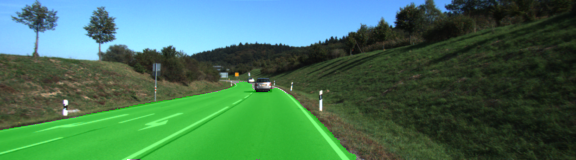
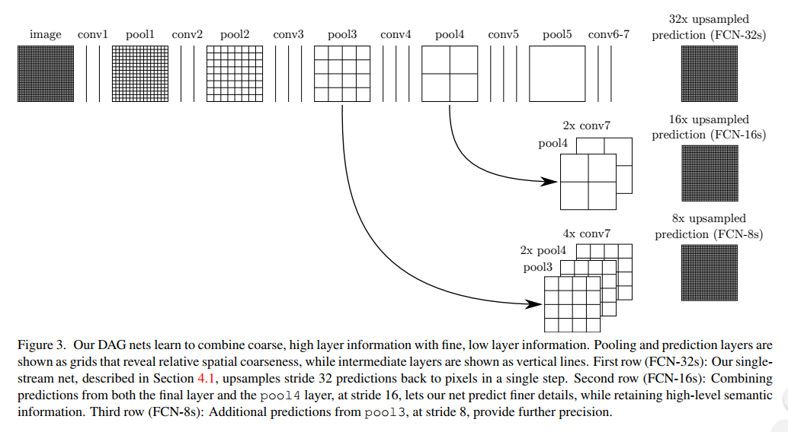

# Semantic Segmentation


### Introduction
The goal of this project is to label the pixels of a road in images using a Fully Convolutional Network (FCN). The FCN paper can be found [here](https://people.eecs.berkeley.edu/~jonlong/long_shelhamer_fcn.pdf). 

FCNs consist of two part, encoder and decoder. The encoder is usually a normal pretrained CNN (e.g. VGG or GoogleNet). The fully connected layers are replaced by 1x1 convolution.
The image is then "upsampled" through the use of "deconvolution" layer (transposed convolutional layers) to restore to the original size. 

### Setup
##### Frameworks and Packages
Make sure you have the following is installed:
 - [Python 3](https://www.python.org/)
 - [TensorFlow](https://www.tensorflow.org/)
 - [NumPy](http://www.numpy.org/)
 - [SciPy](https://www.scipy.org/)
##### Dataset
Download the [Kitti Road dataset](http://www.cvlibs.net/datasets/kitti/eval_road.php) from [here](http://www.cvlibs.net/download.php?file=data_road.zip).  Extract the dataset in the `data` folder.  This will create the folder `data_road` with all the training a test images.

### Implement
Reused the VGG network, pulling out the layer 3/4/7 and follow the FCN paper to implemenet the FCN-8. 


### Run
Run the following command to run the project:
```
python main.py
```
  
 ### Results 
 


 
